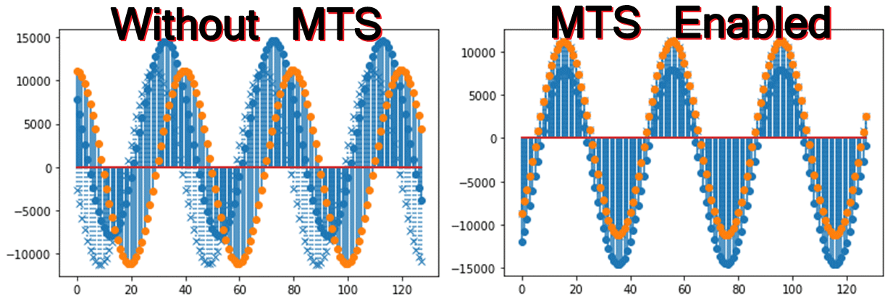
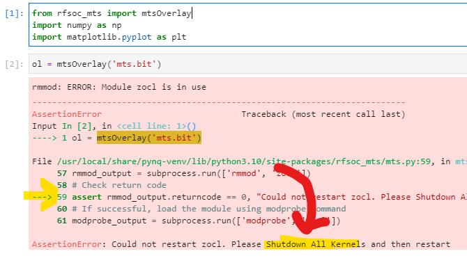
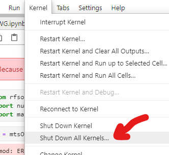

# RFSOC-PYNQ Multi-Tile Synchronization Overlay
This repository hosts an RFSoC overlay compatible with [PYNQ image v3.0.1](https://github.com/Xilinx/PYNQ/releases).  Multi-tile synchronization (MTS) is an important capability of the RFSoC enabling beamforming, phased RADAR arrays, massive MIMO and more.  This overlay demonstrates 4GS MTS capabilities by using a waveform generator to broadcast out two DAC tiles.  The DAC channels are wired to loopback to ADCs.  ADC samples are captured with and without MTS enabled. The effect is shown in the figure below.



The block diagram below describes the loopback structure of the design.  Samples are generated using the DAC RAM and sent to the DAC tiles.  The <a href="./boards/ZCU208/notebooks/CommonBoardWiring.ipynb">loopback configuration</a> sends these samples back to the RFSoC ADC tiles.  Please note that generic "DC Blocks" are necessary to properly couple the DAC to ADC connections, however, it strongly recommended they are the same. Three ADC channels are captured to internal memory storing 64 kilosamples, with the fourth sent to the "deep capture" module.  One can use the PL-DRAM to save samples for longer captures.  


## Board Support
This design is available for the following boards:
* ZCU208
* RFSoC4x2

## Quick Start
Follow the instructions below to install the "mts" overlay. **You will need to give your board access to the internet**.
* Power on your RFSoC development board with an SD Card containing a fresh PYNQ v3.x image.
* You will need to know the IPv4 address of your board which you can find via the USB virtual COM port connection.  Refer to <a href="https://pynq.readthedocs.io/en/v2.6.1/getting_started/terminal.html">"finding your board's IP address"</a>
* Navigate to Jupyter Labs by opening a browser and connecting to `http://<board_ip_address>:9090/lab`.
* Open a terminal in Jupyter as illustrated below:
<p align="center">
  
</p>

Run the code below in the Jupyter terminal to install the RFSoC-MTS project files.

```sh
git clone https://github.com/Xilinx/RFSoC-MTS.git
cd RFSoC-MTS
./install.sh
```

Once installation has finished you will find a *RFSoC-MTS* folder in the Jupyter workspace directory (left-sidebar). One additional notebook is provided for the ZCU208, <a href="./boards/ZCU208/notebooks/CommonBoardWiring.ipynb">CommonBoardWiring</a> describing its wiring diagram so that the DAC tiles loopback full-bandwidth to the ADC tiles via SMA cabling.  The RFSoC4x2 also uses the loop-back configuration and explained within the notebook.

Open the **rfsocMTS** notebook and begin running each cell in order.  If after attempting to load the overlay an AssertionError is thrown reporting, "Could not restart zocl. Please restart Shutdown All Kernels and restart" as shown in the figure below. 

<p align="center">
  
</p>

You may have other notebooks currently open.  Because this design uses a device tree overlay to access PL-DRAM, you will need to shutdown all other kernels before starting this one.  To do this, click on the Kernel menu and then choose "Shut Down All Kernels" as shown in the figure.

<p align="center">
  
</p>

The notebook loads a DAC memory with a user definable waveform.  A sinewave is used in this example and broadcast out multiple DAC channels that are looped to ADC channels.  ADC samples are captured first without MTS and then with MTS. In the example screenshot from the ZCU208, three ADC channels are captured. Two use the same tile, but the third is from an adjacent tile and offset from the others.  When MTS is enabled, the captured ADC samples enter alignment. 

Users may re-run the notebook with different waveform properties and adjust the waveform plots. Once MTS is enabled it will stay active until the overlay is reloaded or notebook re-run.

## Rebuilding the MTS Overlay
To rebuild the provided bitstreams Vivado 2022.1 is required.

### Vivado
Two Vivado board projects are provided called "mts".  It is located under the *boards/ZCU208* and *boards/RFSoC4x2* directories as *build_mts*. A makefile is provided to build the overlays. Running *make all* will start the Vivado build and when finished the **bit** and **hwh** products will remain in the directory.  For example one may do the following:
```sh
cd /<repository-location>/boards/<board_name>/build_mts
```
Once in that directory you may run 'make all' and it will build a bitream and hardware description file.
```sh
make all
```
#### Further Overlay Customization or Inspection
For inspection or customization of the overlay, one may choose to start Vivado and without opening a project, issue the following via the tcl console:
```sh
source mts.tcl
```
This will create the **mts** project for the chosen board and build the block diagram.  This allows the user to further customize the design as per their needs or just inspect within the GUI.  To continue the build process, additional tcl scripts can be run from the console such as: *build_bitstream.tcl* and *check_timing.tcl*, or the user may provide their own.

## License 
[MIT](./LICENSE)
